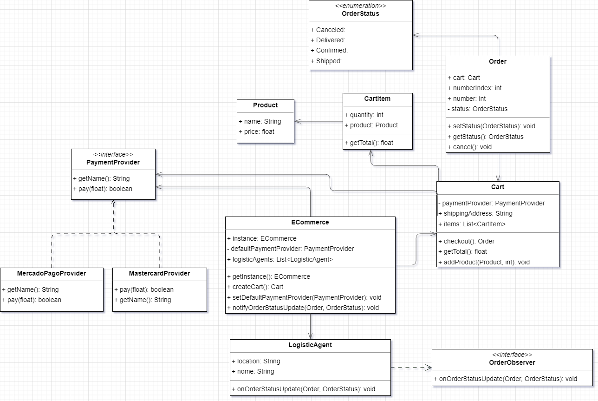

# Avaliação Semestral (Ecommerce)
Matheus Dias Batista Sanches

## Diagrama de classes 

## Justificativas

### Provedores de pagamento

Para os provedores de pagamento, utilizei interfaces para definir um modelo delas. O provedor está salvo como `defaultPaymentProvider` na classe `Ecommerce`, para definir o provedor padrão para os pagamentos.
A classe `Ecommerce` implementa um um **singleton** para que haja apenas uma instancia global, para que o provedor de pagamento seja único também.

### Carrinho de compras

Para os carrinhos de compra, utilizei **injeção de dependência** para passar o provedor de pagamento no construtor, para ser utilizado na função de `checkout()`, que irá criar um Pedido (`Order`).

### Agentes logísticos

Nos agentes logísticos, foi utilizado **observers** para reagirem aos eventos de atualização dos pedidos.
A classe `LogisticAgent` implementa o `OrderObserver` que irá chamar a função `onOrderStatusUpdate()` ao atualizar o status de um pedido.
Ao atualizar o status da classe `Order`, esta irá ativar o evento de atualização dos observers. O singleton do ecommerce (onde contem os observers) ajuará nesse caso para usar a instância única.